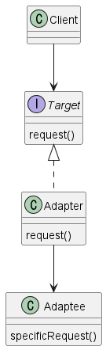

어뎁터 패턴 (Adaptor Pattern) 
---
#### 특정 클래스 인터페이스를 클라이언트에서 요구하는 다른 인터페이스로 변환하는 패턴

### 필요상황
- 기존의 코드가 요구하는 인터페이스와 현재 필요한 인터페이스가 일치하지 않을 때
- 이미 존재하는 클래스를 재사용하고자 할 때 
- 다른 라이브러리나 프레임워크와 통합할 때, 해당 라이브러리나 프레임워크의 인터페이스와 현재 시스템의 인터페이스가 일치하지 않을 경우





### 어뎁터패턴 적용예제1
💡동그라미와 네모를 연결해주는 어댑터패턴 만들기 


#### Target : Square 인터페이스 

```JAVA
public interface Square {
    void drawSquare();
}
```

#### Adaptor : CircleToSquareAdapter 클래스 

어뎁티를 새로 바뀐 인터페이스로 감쌀 떄는 객체 구성(Composition) 을 사용함 

```JAVA
public class CircleToSquareAdapter implements Square {
    private Circle circle;

    public CircleToSquareAdapter(Circle circle) {
        this.circle = circle;
    }

    @Override
    public void drawSquare() {
        System.out.println("Draw Square (converted from Circle)");
    }
}
```

#### Adaptee : Circle 클래스 

```JAVA
public class Circle {
    public void drawCircle() {
        System.out.println("Draw Circle");
    }
}
```

#### Client : Client클래스 

```JAVA
public class Client {
    public static void main(String[] args) {
        Circle circle = new Circle();
        Square adapter = new CircleToSquareAdapter(circle);

        adapter.drawSquare();
    }
}
```


퍼사드 패턴 (Facade Pattern) 
---
#### 서브시스템에 있는 일련의 인터페이스를 통합 인터페이스로 묶어줌. 


### 필요상황
- 복잡한 서브시스템이 존재할 때
- 서브시스템의 인터페이스가 다양하게 변할 때
- 클라이언트와 서브시스템 간의 의존성을 감소시킬 때
- 시스템의 유연성이 필요한 경우
- 클라이언트 코드의 간소화가 필요한 경우


### 퍼사드패턴 적용예제1
💡금융서비스 퍼사드 패턴으로 만들기


#### SubSystem : BankAccount, LoanService
```JAVA
class BankAccount {
    private String account;
    private double balance;

    public BankAccount(String account, double balance) {
        this.account = account;
        this.balance = balance;
    }

    public String getAccount() {
        return account;
    }

    public double getBalance() {
        return balance;
    }

    public void deposit(double amount) {
        balance += amount;
        System.out.println("Deposited $" + amount + " to account " + account);
    }

    public void withdraw(double amount) {
        if (balance >= amount) {
            balance -= amount;
            System.out.println("Withdrawn $" + amount + " from account " + account);
        } else {
            System.out.println("Insufficient funds in account " + account);
        }
    }
}

class LoanService {
    public void applyForLoan(BankAccount account, double loanAmount) {
        System.out.println("Loan application for account " + account.getAccount() +
                " with amount $" + loanAmount + " submitted");
    }
}

```


#### Facade : FinancialServiceFacade
```JAVA
class FinancialServiceFacade {
    private BankAccount bankAccount;
    private LoanService loanService;

    public FinancialServiceFacade(BankAccount bankAccount, LoanService loanService) {
        this.bankAccount = bankAccount;
        this.loanService = loanService;
    }

    public void depositMoney(double amount) {
        bankAccount.deposit(amount);
    }

    public void withdrawMoney(double amount) {
        bankAccount.withdraw(amount);
    }

    public void applyForLoan(double loanAmount) {
        loanService.applyForLoan(bankAccount, loanAmount);
    }

    public double checkAccountBalance() {
        return bankAccount.getBalance();
    }
}

```

#### Client :  Client클래스 

```JAVA
public class Client {
    public static void main(String[] args) {
        BankAccount bankAccount = new BankAccount("5000", 1000.0);
        LoanService loanService = new LoanService();

        FinancialServiceFacade financialServiceFacade = new FinancialServiceFacade(bankAccount, loanService);

        financialServiceFacade.depositMoney(500.0);
        financialServiceFacade.withdrawMoney(200.0);
        financialServiceFacade.applyForLoan(10000.0);

        // 계좌 잔액 조회
        double accountBalance = financialServiceFacade.checkAccountBalance();
        System.out.println("Account Balance: $" + accountBalance);
    }
}
```