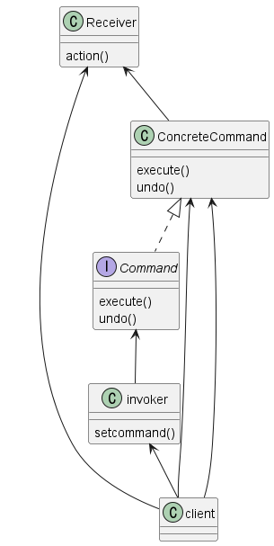

커맨드 패턴 (Command Pattern) 
---
#### 요청내역을 객체로 캡슐화하여 객체를 다른 요청내역에 따라 매개 변수화 할 수있는 패턴


```JAVA
public class LightOnCommand implements Command {
	private Light light;

	public LightOnCommand(Light light) {
		this.light = light;
	}

	public void execute() {
		light.on();
	}
}


public class RemoteLoader {
 
	public static void main(String[] args) {
		RemoteControl remoteControl = new RemoteControl();
 
		Light livingRoomLight = new Light("Living Room");
		LightOnCommand livingRoomLightOn = new LightOnCommand(livingRoomLight);
	
        RemoteControl remoteControl = new RemoteControl();
    	remoteControl.setCommand(0, livingRoomLightOn, livingRoomLightOff);
    }

}
```

--- 
### 필요 상황
- 요청 매개변수화, 큐에 넣어 지연 또는 로깅처리
- 취소/재실행 기능
- 로그 기능 



- Client : 커맨드, 리시버 설정
- Invork : 객체에게 특정작업을 요청
- Command : 커맨드 객체에서 구현해야하는 인터페이스
- ConcreteCommand : 특정 행동과 리시버를 연결시켜줌 
- Receiver : 어떤 일을 처리해야하는 지 알고 있는 객체


---

### 커맨드 패턴 적용예제 1 
#### 💡스프링 프레임워크에 적용된 데코레이터 패턴을 찾아보자


```JAVA
import java.util.logging.Logger;

// 명령 인터페이스
public interface Command {
    void execute();
    void undo();
}


// 전등을 켜는 명령 클래스
public class TurnOnCommand implements Command {
    private Light light;
    private static final Logger LOGGER = Logger.getLogger(TurnOnCommand.class.getName());

    public TurnOnCommand(Light light) {
        this.light = light;
    }

    @Override
    public void execute() {
        light.turnOn();
        LOGGER.info("전등을 켰습니다.");
    }

    @Override
    public void undo() {
        light.turnOff();
        LOGGER.info("전등을 다시 껐습니다.");
    }
}


// 전등을 끄는 명령 클래스
public class TurnOffCommand implements Command {
    private Light light;
    private static final Logger LOGGER = Logger.getLogger(TurnOffCommand.class.getName());

    public TurnOffCommand(Light light) {
        this.light = light;
    }

    @Override
    public void execute() {
        light.turnOff();
        LOGGER.info("전등을 껐습니다.");
    }

    @Override
    public void undo() {
        light.turnOn();
        LOGGER.info("전등을 다시 켰습니다.");
    }
}

// 전등 클래스 (수신자)
public class Light {
    public void turnOn() {
        System.out.println("전등이 켜졌습니다.");
    }

    public void turnOff() {
        System.out.println("전등이 꺼졌습니다.");
    }
}

// Invoker 클래스
public class RemoteControl {
    private Command command;
    private List<Command> commandHistory = new ArrayList<>();

    public void setCommand(Command command) {
        this.command = command;
    }

    public void pressButton() {
        command.execute();
        commandHistory.add(command);
    }

    public void undoLastCommand() {
        if (!commandHistory.isEmpty()) {
            Command lastCommand = commandHistory.remove(commandHistory.size() - 1);
            lastCommand.undo();
        }
    }
}

public class Client {
    public static void main(String[] args) {
        Light light = new Light();
        RemoteControl remote = new RemoteControl();

        Command turnOnCommand = new TurnOnCommand(light);
        Command turnOffCommand = new TurnOffCommand(light);

        remote.setCommand(turnOnCommand);
        remote.pressButton();

        remote.setCommand(turnOffCommand);
        remote.pressButton();

        remote.undoLastCommand();
    }
}

```