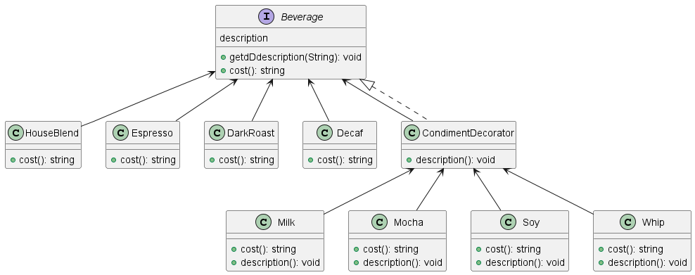

데코레이터 패턴 (Decorater Pattern) 
---
#### 객체의 추가 요소를 동적으로 더할 수 있는 패턴 
데코레이터를 사용하면 서브클래스보다 유연하게 기능 확장 가능 

--- 
### 필요 상황
- OCP 원칙- 확장에는 열려있지만 변경에는 닫혀있도록 만들기 위해서

### 일반적 상속과 차이는? 

.............

---
### 데코레이터 패턴 적용예제1

### 데코레이터 패턴 적용예제2 

#### 스타벅스 커피 주문 시스템 
다양한 음료와 각 음료에 대한 다양한 옵션(우유,두유, 휘핑크림 등)이 필요할 떄  

> Source. 헤드퍼스트 디자인패턴

### 데코레이터 패턴 적용예제3 