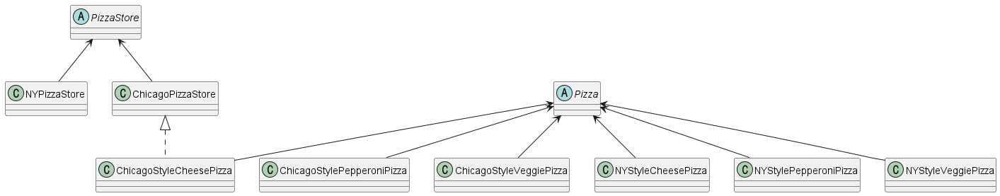

팩토리 패턴 (Factory Pattern) 
---
#### 객체 생성을 처리하기 위한 디자인 패턴

--- 
### 심플 팩토리
- 어플리케이션에서 유일하게 "어떤" 객체 생성을 전담하는 클래스
- 객체 생성로직 분리 > 유연성 향상

---
#### 💡<헤드퍼스트 예시> SimplePizzaFactroy


---
### 팩토리 메소드 패턴
- 객체 생성시 필요한 인터페이스 만들고 객체 생성은 서브 클래스에 맡김
- 사용하는 서브클래스에 따라 객체 인스턴스 결정 


---
#### 💡<헤드퍼스트 예시> Pizza Store Framework


```JAVA
// PizzaStore 
// 팩토리 메소드를 추상 메소드로 선언해서 서버 클래스가 객체 생성을 책임짐
// 팩토리 메소드를 통해서 특정 객체를 리턴하게 함 
public abstract class PizzaStore {
	abstract Pizza createPizza(String item);
}

public class ChicagoPizzaStore extends PizzaStore {

	Pizza createPizza(String item) {
        	if (item.equals("cheese")) {
            		return new ChicagoStyleCheesePizza();
        	} else if (item.equals("veggie")) {
        	    	return new ChicagoStyleVeggiePizza();
        	} else if (item.equals("clam")) {
        	    	return new ChicagoStyleClamPizza();
        	} else if (item.equals("pepperoni")) {
            		return new ChicagoStylePepperoniPizza();
        	} else return null;
	}
}
```
---

### 추상팩토리 패턴
- 구상 클래스에 의존하지 않고 서로 연관되거나 의존적인 객체로 이뤄지는 제품군을 생성하는 인터페이스 제공
- 여러 연관된 객체의 생성을 담당하는 인터페이스를 제공함

#### 💡<헤드퍼스트 예시> 

```JAVA
// PizzaIngredientFactory : interface  
public interface PizzaIngredientFactory {

	public Dough createDough();
	public Sauce createSauce();
	public Cheese createCheese();
	public Veggies[] createVeggies();
	public Pepperoni createPepperoni();
	public Clams createClam();
 
}
```
```JAVA
public class NYPizzaIngredientFactory implements PizzaIngredientFactory {
 
	public Dough createDough() {
		return new ThinCrustDough();
	}
 
	public Sauce createSauce() {
		return new MarinaraSauce();
	}
 
	public Cheese createCheese() {
		return new ReggianoCheese();
	}
 
	public Veggies[] createVeggies() {
		Veggies veggies[] = { new Garlic(), new Onion(), new Mushroom(), new RedPepper() };
		return veggies;
	}
 
	public Pepperoni createPepperoni() {
		return new SlicedPepperoni();
	}

	public Clams createClam() {
		return new FreshClams();
	}
}
```

----
### 추상팩토리 패턴 vs 펙토리 메소드 패턴
- 모두 객체 생성과 관련된 패턴
- 추상팩토리는 "구성"으로, 팩토리 메소드는 "상속"으로 객체 생성
 

----------------------------------

### 팩토리 패턴 적용예제

💡스프링 프레임워크에 적용된 팩토리 패턴을 찾아보자

> BeanFactory/ApplicationConText
: spring 프레임워크에 대한 Bean을 관리하는 인터페이스

1. 설정정보를 읽어와서 Context 초기화
2. 객체에 대한 생성을 직접하지 않고 Bean을 가져옴

```JAVA
        ApplicationContext context = new ClassPathXmlApplicationContext("applicationContext.xml");
        Example Bean = (Example) context.getBean("example");
```

-------------------------------------


> Source. 헤드퍼스트 디자인패턴