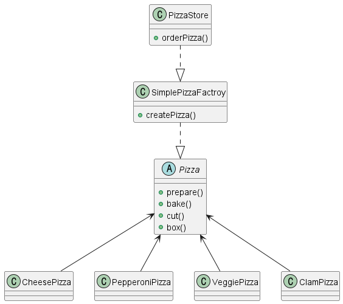
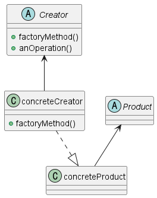

팩토리 패턴 (Factory Pattern) 
---
#### 객체 생성을 처리하기 위한 디자인 패턴

--- 
### 심플 팩토리
- 어플리케이션에서 유일하게 "어떤" 객체 생성을 전담하는 클래스

#### 💡<헤드퍼스트 예시> SimplePizzaFactroy 




### 팩토리 메소드 패턴
- 객체 생성시 필요한 인터페이스 만듬
- 어떤 클래스의 인스턴스를 만들지는 서브 클래스에서 결정함
- 객체 생성을 서브 클래스에 캡슐화
- 사용하는 서브클래스에 따라 객체 인스턴스 결정됨 
- 클라이언트 코드와 서브클래스 내 객체 생성 코드 분리
- 심플한 팩토리와 유사하지만, 좀 더 유연함 => 생성 product를 마음대로 변경가능




### 추상팩토리 패턴
- 구상 클래스에 의존하지 않고 서로 연관되거나 의존적인 객체로 이뤄지는 제품군을 생성하는 인터페이스 제공
- 여러 연관된 객체의 생성을 담당하는 인터페이스를 제공함


### 추상팩토리 패턴 vs 펙토리 메소드 패턴
- 모두 객체 생성과 관련된 패턴
- 추상팩토리는 "구성"으로, 팩토리 메소드는 "상속"으로 객체 생성
 

----------------------------------

### 팩토리 패턴 적용예제

💡스프링 프레임워크에 적용된 팩토리 패턴을 찾아보자

BeanFactory/ApplicationConText
: spring 프레임워크에 대한 Bean을 관리하는 인터페이스

1. 설정정보를 읽어와서 Context 초기화
2. 객체에 대한 생성을 직접하지 않고 Bean을 가져옴

```JAVA
        ApplicationContext context = new ClassPathXmlApplicationContext("applicationContext.xml");
        Example Bean = (Example) context.getBean("example");
```


> Source. 헤드퍼스트 디자인패턴