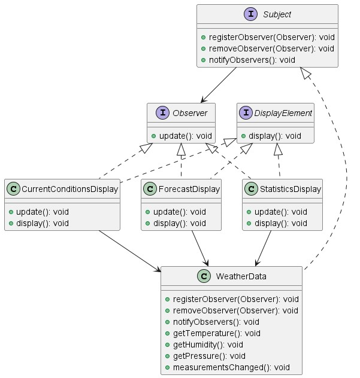
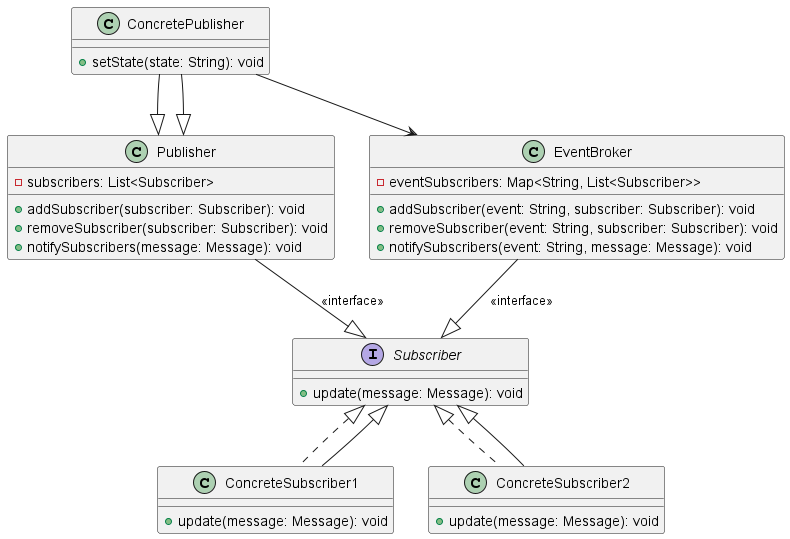

옵저버 패턴 (Observer Pattern) 
---
#### 객체의 상태값이 변경되면 그 객체의 의존하는 다른 객체에게 연락이 가고 자동으로 갱신되는 패턴


---
### 필요 상황

- 객체의 상태변화에 대한 처리가 필요할 때
- 이벤트 처리 및 핸들링이 필요할 때
- 통신
  (분산 시스템에서 효과적인 통신 시 출판 구독 패턴도 많이 사용됨)

---
### 옵저버 패턴 적용예제1

💡스프링 프레임워크에 적용된 옵저버 패턴을 찾아보자

> 스프링 프레임워크 이벤트 동작원리

- Observer ➡️ ApplicationListener  
- Subject  ➡️ ApplicationEventPublisher  


1. 옵저버 생성
```JAVA
@Component
public class ObserverListenerA implements ApplicationListener<AppEvent> {
    
    @Override
    public void onApplicationEvent(AppEvent event) {
        System.out.println(event.getName() + " Listener A");
    }
}
```

```JAVA
@Component
public class ObserverListenerB implements ApplicationListener<AppEvent> {
    
    @Override
    public void onApplicationEvent(AppEvent event) {
        System.out.println(event.getName() + " Listener B");
    }
}
```

2. Subject->Observer에게 정보 갱신요청

ApplicationEventPublisher는 주로 Spring Context에 의해서 구현됨

```JAVA
@Component
public class AppRunner implements ApplicationRunner {
 
    @Autowired
    ApplicationEventPublisher eventPublisher;
 
    @Override
    public void run(ApplicationArguments args) throws Exception {
        eventPublisher.publishEvent(new AppEvent(this, "Observer"));        
    }
}

```

3. Subject-Observer 간 느슨한 결합

[스프링 내부코드] SimpleApplicationEventMulticaster 

```JAVA
	@Override
	public void multicastEvent(ApplicationEvent event, @Nullable ResolvableType eventType) {
		ResolvableType type = (eventType != null ? eventType : ResolvableType.forInstance(event));
		Executor executor = getTaskExecutor();
		for (ApplicationListener<?> listener : getApplicationListeners(event, type)) {
			if (executor != null && listener.supportsAsyncExecution()) {
				executor.execute(() -> invokeListener(listener, event));
			}
			else {
				invokeListener(listener, event);
			}
		}
	}
```


---
### 옵저버 패턴 적용예제2

#### 기상 모니터링 애플리케이션

- 3가지 기상조건 (온도, 습도, 기압) 가져오기 
- 조회 시 실시간 갱신하여 화면에 표시




---

### 발행-구독 패턴

- 발행자와 구독자 개념이 Observer/Subject 개념과 유사
- 그러나 발행-구독패턴은 사이에 이벤트 브로커가 있어 더욱 느슨한 결합을 제공함


---
### 발행-구독패턴의 사용 

- 미들웨어 통신에서 주로 사용됨  
- 메시지큐를 이용한 비동기식 메시지 시스템 
- 최근에 message broker의 역할로 redis, kafka, RebbitMQ 등이 사용됨


