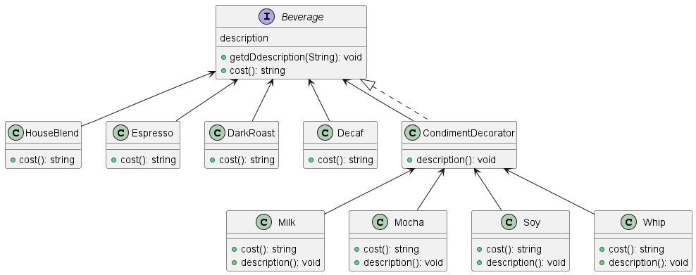

데코레이터 패턴 (Decorater Pattern) 
---
#### 객체의 추가 요소를 동적으로 더할 수 있는 패턴 


--- 
### 필요 상황
- OCP 원칙을 따르고 싶을 때 
- 상속보다 유연하게 기능을 확장을 하고 싶을 때 

### 데코레이션 <> 상속 
- 상속은 "is-a" 관계, 데코레이터 패턴은 "has-a" 관계
- 데코레이터 패턴은 상속과는 달리 객체를 동적으로 조정할 수 있음 
 

### 데코레이션의 단점 
- 특정 기능을 분리하면서 잡다한 데코레이터 클래스가 많아짐 
- 소스코드 생성 시 보기 좋지 않음 


---

### 데코레이터 패턴 적용예제 1 
💡스프링 프레임워크에 적용된 데코레이터 패턴을 찾아보자

아래와 같은 클래스가 있음
- BeanDefinitionDecorator ➡️ 빈의 정의를 동적으로 변경하거나 확장할때 사용하는 클래스 

솔루션 업체에서 프레임워크를 커스텀할 때 사용됨 

1. XML 스키마 작성
2. NamespaceHandler 구현
3. BeanDefinitionParser 구현
4. BeanDefinitionDecorator 로 빈 설정 변경 


```JAVA
public class DecoratorBeanDefinitionDecorator implements BeanDefinitionDecorator {
    @Override
    public BeanDefinitionHolder decorate(Node node, BeanDefinitionHolder definition, ParserContext parserContext) {
        // 생략 
        return definition;
    }
}
```
---

### 데코레이터 패턴 적용예제 2

#### 💡 자바 I/O 클래스 

- 자바 I/O 클래스들은 다양한 입출력을 가능하게 하도록 데코레이션 패턴을 사용함 

- InputStream ➡️ 데이터를 바이트 단위로 읽을 수 있는 기능을 제공하는 클래스
- FilterInputStream ➡️ 데코레이터 패턴을 사용하여 InputStream를 확장한 클래스로 필터링 동작 추가할 수있음 
- BufferedInputStream ➡️ FilterInputStream의 하위 클래스 입출력 성능을 향상시키기 위해 내부적으로 데이터를 버퍼링시킨 클래스 
- 그 외에도 여러 데코레이터를 조합하여 다양한 입출력 기능을 지원


---

### 데코레이터 패턴 적용예제 3

#### 💡커피 주문 시스템 

- 다양한 음료와 각 음료에 대한 다양한 옵션 (우유, 두유, 휘핑크림 등)이 존재하는 상황
- 옵션 추가에 따른 가격 변동이 일어나는 상황 




---


> Source. 헤드퍼스트 디자인패턴
